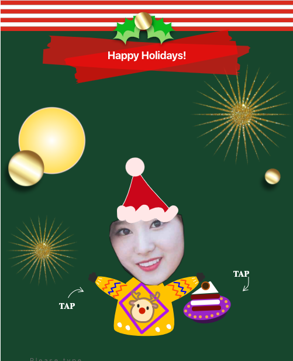

안녕하세요,
오늘은 <a href="https://github.com/justadudewhohacks/face-api.js/">face-api.js</a>라고 하는 tensorflow.js를 통해 구현된 high level face recognition api를 활용하는 방법을 공유해보려고 합니다.

### 배경

2019년 크리스마스 직전 친구들과 모바일 크리스마스 카드를 만드는 일을 급작스럽게 기획하게 되었는데, 이 때 `자기 얼굴을 카드에 넣을 수 있는 기능`이 포함되면 좋겠다는 아이디어가 발제되었습니다. 처음에는 단순하게 <a href="https://developer.mozilla.org/ko/docs/Web/HTML/Canvas">HTML Canvas api</a>를 활용해 원형으로 cropping하거나 본인이 직접 얼굴형태를 그려 cropping하는 것을 고민했습니다만, 어떤 방식이든 사용성이 떨어질 가능성이 높다는 판단이 들었습니다.

그렇게 해결방안을 고민하던 중 위에서 언급한 `face-api.js`를 발견하고 자동으로 얼굴을 cropping해주는 기능을 만들어보기로 했습니다.

### 구현 방법

아이디어는 간단합니다. 이미 구현되어 있는 **pre-trained model**을 기반으로 얼굴을 inference하고 inference에서 나온 x, y 좌표(landmark)를 모아 Canvas에서 잘라내기를 하는 것이죠.

(적어도 face cropping에) 필요한 패키지를 설치해줍시다.

```bash
yarn add face-api.js hull.js
```

앞서 설명드렸듯 face-api.js는 얼굴 detection 및 landmark inference용으로 필요하고, <a href="https://andriiheonia.github.io/hull/">hull.js</a>에서는 뒤에서 다시 설명드리겠지만 Landmark 데이터를 정렬하기 위한 용도로 활용했습니다.

설치만 하면 끝일 것 같은데, 아쉽게도 추가적인 일 하나가 더 필요합니다. <a href="https://github.com/justadudewhohacks/face-api.js/tree/master/weights">pre-trained model(weight)</a>을 추가로 다운로드받는 일인데요. pre-traiend된 모델을 사용할 것이기 때문에 미리 학습된 데이터의 가중치들을 받아오는 일을 잊고 넘어갈 수는 없겠죠?

저는 성능이 당장 얼굴을 엄밀하게 찾아내고, landmark들을 찾아내는 작업보다는 빠르게 inference해서 얼굴을 cropping하는 것이 중요했기 때문에 tiny모델들만 `public`폴더에 저장해뒀습니다.

아래는 그 가중치 파일의 목록입니다.

<a href="https://github.com/dohyungp/ugly-xmas-card/tree/master/public/models">/public/models/*</a>

```
face_landmark_68_tiny_model-shard1
face_landmark_68_tiny_model-weights_manifest.json
tiny_face_detector_model-shard1
tiny_face_detector_model-weights_manifest.json
```

네, 이제 진짜 코드를 작성해볼 시간입니다.

이제 열심히 다운받았을 weight를 불러오는 일부터 시작해야 하는데요.

```js
import * as faceapi from "face-api.js";

export async function loadModels() {
  const MODEL_URL = process.env.PUBLIC_URL + "/models";
  faceapi.loadTinyFaceDetectorModel(MODEL_URL).then(() => {
    console.log("Completed loading Face model");
  });
  faceapi.loadFaceLandmarkTinyModel(MODEL_URL).then(() => {
    console.log("Completed loading Landmark model");
  });
}
```

먼저 `loadTinyFaceDetectorModel`와 `loadFaceLandmarkTinyModel`로 모델을 로딩해줍니다. 아무리 작은 모델이라도 네트워크 모델인만큼 비동기로 로딩시키는 것이 중요하겠죠. 기본적으로 두 함수는 비동기로 구현되어 있다는 점 짚어드립니다 🙂

자 이제는 얼굴을 찾고 특징점, Landmark를 찾는 함수를 만들어보겠습니다.

```js
export async function getFullFaceDescription(blob, imageSize, inputSize = 512) {
  let scoreThreshold = 0.3;
  const OPTION = new faceapi.TinyFaceDetectorOptions({
    inputSize,
    scoreThreshold
  });
  const useTinyModel = true;
  let img = await faceapi.fetchImage(blob);
  let detections =
    (await faceapi
      .detectSingleFace(img, OPTION)
      .withFaceLandmarks(useTinyModel)) || {};
  const resizedDetections = faceapi.resizeResults(detections, imageSize);
  return resizedDetections;
}
```

high level api인 만큼 이번 코드도 읽기 간편합니다. 필요한 argument는 3개인데요. blob은 이미지의 data-uri, imageSize는 포함될 이미지 사이즈(width와 height으로 구성된 Object), 마지막으로 inputSize는 inference 시 활용할 input의 size를 보냅니다(기본적으로 512를 사용하기 때문에 default로 512를 지정했습니다).

자 이제 faceapi에서 `detectSingFace`를 통해 얼굴 하나를 inference하고~~(single이 있다면 many도 있겠죠?)~~, 추가로 얼굴을 cropping하는데 필요한 Landmark정보도 필요하므로 `withFaceLandmarks`도 함께 사용해, Landmark 정보를 함께 얻어냅시다!

정상적으로 얼굴이 inference되었다는 가정 하에 저희는 아래와 같이 `getJawOutline`, `getLeftEyeBrow`, `getRightEyeBrow` 함수들을 활용해 각 x, y좌표값을 얻어낼 수 있습니다.

```js
 let points = detection.landmarks
    ? [
        ...detection.landmarks.getJawOutline(),
        ...detection.landmarks.getLeftEyeBrow(),
        ...detection.landmarks.getRightEyeBrow()
      ]
    : [];
```

각 함수를 통해 얻어낸 x, y좌표값들을 저는 array로 묶어주었습니다.

그런데 여기서 한가지 문제가 있는데요. 데이터 포인트들이 canvas에서 cropping하기 좋은 구조로 정렬되어 있지 않다는 것인데요. 때문에 테스트하는 동안 제 얼굴이 여러번 뭉개져버렸습니다😭.
그래서 특단의 조치로 대학시절 알고리즘 시간에 배웠던 <a href="https://ko.wikipedia.org/wiki/%EB%B3%BC%EB%A1%9D_%EA%BB%8D%EC%A7%88_%EC%95%8C%EA%B3%A0%EB%A6%AC%EC%A6%98">convex-hull problem</a>과 같은 방식으로 접근해보기로 합니다. 다행히 convex-hull을 위한 정렬 패키지가 있었고, 이는 위에서 언급한 `hull.js`였습니다. 이 패키지도 굉장히 간단한 방식으로 사용이 가능한데요.

```js
const points = hull(pointset, 300, [".x", ".y"]);
```

다음과 같이 정렬하면 충분합니다. 여기서 300이라는 수치가 들어간 부분은 `concavity`를 의미합니다. `concavity`가 높을수록 디테일은 줄어드는 대신 좀 더 smooth하게 된 곡선값을 얻어낼 수 있습니다. `[".x", ".y"]`부분은 faceapi로부터 넘어온 landmark들이 x, y꼴로 들어오고 hull.js에서 해당 좌표를 활용해 정렬할 것임을 알려주는 형식입니다.

자 이제 다 끝났습니다.

dom을 이용해 새로운 canvas를 만들어주고, 얼굴만큼만 떼어내서 그려주면 끝입니다.

언급했던 부분들을 코드로 한번에 묶어보자면, 다음과 같습니다.


```js
export function cropContour(ctx, pointset, isClosed = false) {
  const points = hull(pointset, 300, [".x", ".y"]);
  ctx.beginPath();
  points.slice(1).forEach(({ x, y }) => {
    ctx.lineTo(x, y);
  });

  if (isClosed) {
    const from = points[points.length - 1];
    const to = points[0];
    if (!from || !to) {
      return;
    }

    ctx.moveTo(from.x, from.y);
    ctx.lineTo(to.x, to.y);
  }

  ctx.closePath();
  ctx.stroke();
  ctx.clip();
}

export function cropImage(imgEl, detection) {
  const canvas = document.createElement("canvas");
  canvas.width = imgEl.width;
  canvas.height = imgEl.height;
  canvas.getContext("2d").drawImage(imgEl, 0, 0, imgEl.width, imgEl.height);
  let points = detection.landmarks
    ? [
        ...detection.landmarks.getJawOutline(),
        ...detection.landmarks.getLeftEyeBrow(),
        ...detection.landmarks.getRightEyeBrow()
      ]
    : [];

  if (points.length === 0) return;

  let minX = 10000,
    minY = 10000,
    maxX = -10000,
    maxY = -10000;

  points.forEach(point => {
    if (point.x < minX) minX = point.x;
    if (point.y < minY) minY = point.y;
    if (point.x > maxX) maxX = point.x;
    if (point.y > maxY) maxY = point.y;
  });

  const nWidth = maxX - minX,
    nHeight = maxY - minY;

  const ctx = canvas.getContext("2d");
  ctx.save();
  ctx.clearRect(0, 0, canvas.width, canvas.height);
  ctx.lineWidth = 4;
  cropContour(ctx, points);
  ctx.drawImage(imgEl, 0, 0);
  ctx.restore();

  const croppedCanvas = document.createElement("canvas");
  const croppedCtx = croppedCanvas.getContext("2d");
  croppedCanvas.width = nWidth;
  croppedCanvas.height = nHeight;
  croppedCtx.drawImage(
    canvas,
    minX,
    minY,
    nWidth,
    nHeight,
    0,
    0,
    nWidth,
    nHeight
  );

  return croppedCanvas.toDataURL();
}
```

위의 코드는 <a href="https://github.com/dohyungp/ugly-xmas-card/blob/master/src/utils/functions.jsx">functions.jsx</a>라는 파일에 묶어뒀습니다.

네, 이제 끝입니다! 이런 방식으로 우리는 다음과 같이 얼굴이 자르는 기능을 만들어낼 수 있습니다.



사실 제한된 시간 내에 크리스마스 카드를 만들기 위해 React, Mobx, React Router 등 다양한 코드들을 뒤죽박죽 섞어놓았습니다만, 이번 카드 제작에 핵심적으로 필요했던 코어기능들은 이 Functions가 전부라고 볼 수 있습니다.
그럼에도 불구하고 저의 누추한 코드를 보고 싶으시다면 언제든지 <a href="https://github.com/dohyungp/ugly-xmas-card/">코드 repo</a>에 오셔서 보셔도 좋습니다.

### 후기

- 크리스마스를 코앞에 두고 제한된 시간에 급박하게 만든 코드라 수정의 애착이 잘 가지 않습니다. 그래서 코드 업데이트가 꽤 느릴 수 있으나 내년 크리스마스를 목표로 (언젠간) 조금씩 수정해볼 계획은 있습니다.
- 사실 위에서 언급하지는 않았지만 스마트폰 화질이 급격하게 올라가다보니 테스트하면서 코드 상에 화질 압축하는 부분도 사실 포함시켜뒀습니다. 코드를 읽다보면 발견하실 수도 있어요(갤럭시 S20은 100배줌을 지원한다던데 ...)
- CSS를 잘못 짜서 폰에서 키보드를 누르면 난리가 납니다. 이 부분을 얼른 고쳐야 되는데 1번의 이유로 손이 잘 안가서 README부터 차근차근 고쳐보려고 합니다.
- Share 기능은 글로벌을 타겟으로 하자는 친구의 제안에 HTML Share API를 사용했습니다만, 지금와서 생각컨대 그냥 카카오 공유기능이 나을걸 그랬습니다. 여러가지 경우로 인해 share api가 안되는 일이 너무 많습니다.
- 급하게 하느라 Firebase Storage를 하나 만들고 html dom을 png로 만들어 공유하도록 했습니다. 코드를 만지게 된다면 고쳐야 하는 부분 중 하나로 (언젠간) url 공유로 변경하려고 하고 있습니다.
- (결론) 뭐든지 급하게 하기보다 차근차근 필요한 것들을 정리하면서 일을 하는 습관을 기르는게 좋습니다.

