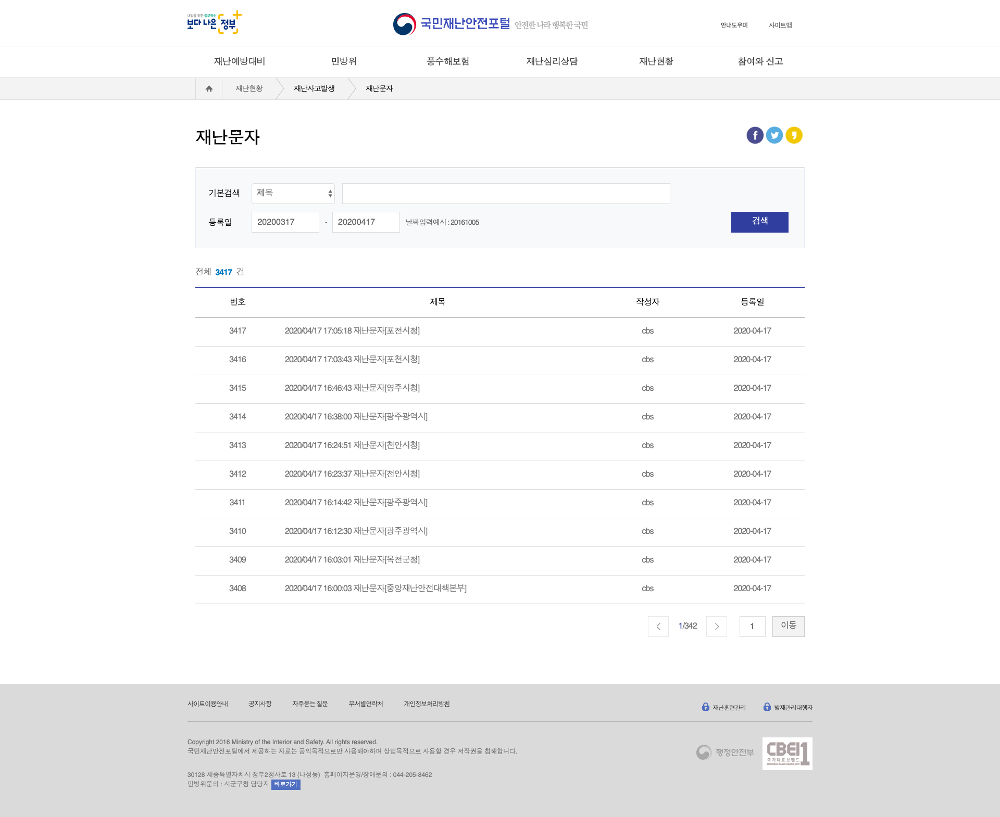
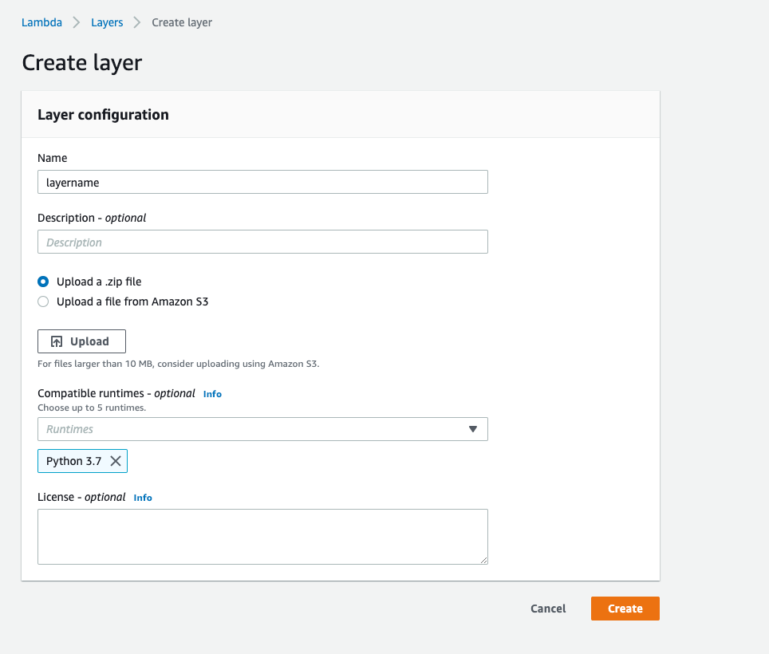
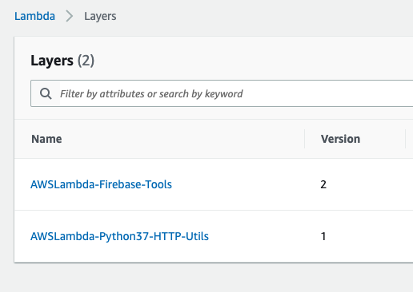
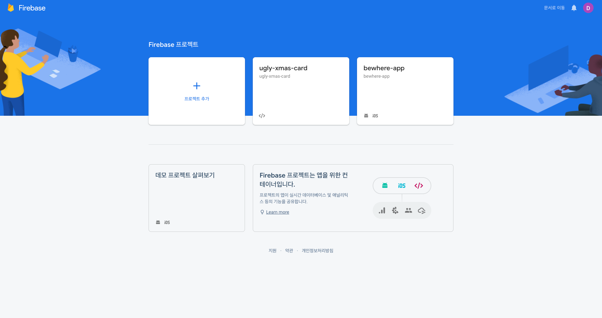
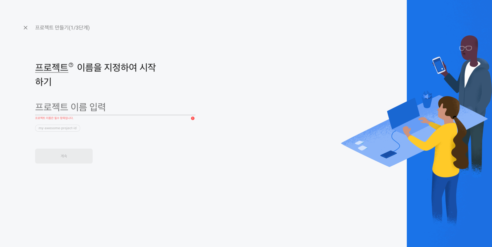
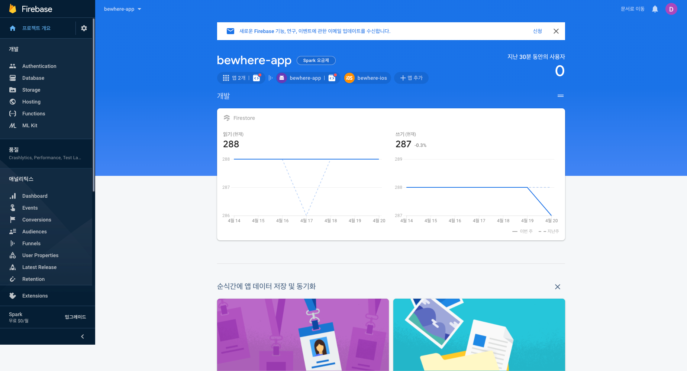
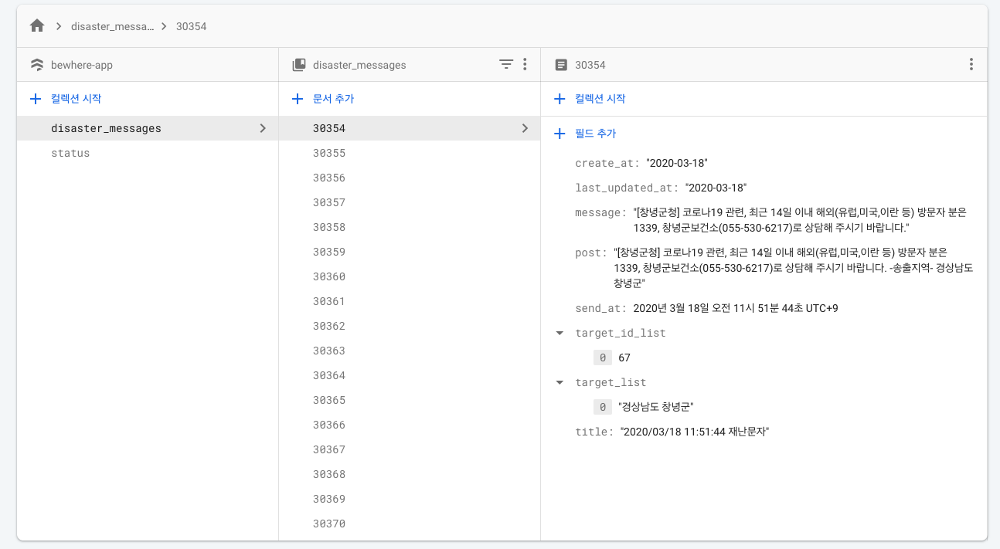

### 발단

코로나19 이후 핸드폰 재난문자량이 폭증했습니다. 분명 하나하나 제 안전에 매우 중요한 정보들임은 틀림없으나, 제 지역 외 다른 지역 문자들이 함께 와 진짜 알아야 할 정보들을 파묻혀버리는 문제가 있었습니다.
5G 시대가 도래하면 해결될 문제라고 하지만 이 참에 재난문자 필터링 앱을 하나 만들어보자 싶었습니다(~~앱을 만드는 경험을 해본 적이 없어 만들어보자 시도하던 참이었거든요~~)

개인의 삶이 바빠 현재는 클라이언트단 개발이 밀리고 있지만, 그럼에도 뒷단은 어떻게 구성했는지 간단하게 설명해보고자 블로그를 써봅니다.

### 왜 스크래핑을 하게 됐는가

원래 처음에는 <a href="https://www.data.go.kr/dataset/3058822/openapi.do">공공데이터 포털의 재난문자발령현황 서비스</a>를 사용해보려고 시도해봤습니다. 하지만 하루 4번 업데이트된다는 점에서 실시간성을 기대하기 어려웠고, 해당 OPEN API 사용을 포기하게 되었습니다.

때문에 차선으로 선택한 것이 <a href="http://www.safekorea.go.kr/idsiSFK/neo/main/main.html">국민재난안전포털</a>을 스크래핑하는 것이었습니다.



위의 이미지처럼 재난문자 리스트가 발생직후 빠르게 업데이트가 되고 있는데요. 이 업데이트를 기간을 두고 모니터링해본 결과 거의 직후 업데이트된다는 사실을 깨달았습니다. 따라서 이 데이터를 잘 긁어보자가 오늘의 내용입니다.

### 어떻게 스크래핑을 하는가

Developer console을 통해 국민재난안전포털의 데이터가 브라우저와 어떻게 통신되는지 보자니,

```py
[
   {
      "LAST_MODF_DT":"2020-03-16",
      "BBS_NO":63,
      "FRST_REGIST_DT":"2020-03-16",
      "BBS_ORDR":30188,
      "SJ":"2020/03/16 19:04:23 재난문자",
      "IDX_NO":9695,
      "QRY_CNT":0,
      "CN":"[시청]코로나19 확진자 발생\r\n\r\n-송출지역-\r\n시청",
      "title":"",
      "USR_NM":"cbs",
      "USR_EXPSR_AT":"Y"
   }
]
```

다음과 같은 형태의 JSON이 파일 형식으로 통신되고 있었습니다. 따라서, 이 데이터를 정기적으로 스크랩하면 되겠다! 라는 생각을 하게 되었습니다(참고로 해당 JSON파일은 `disasterData_{숫자}.json`꼴로 숫자만 auto increment시키면 되는 상황이었습니다)

이제 무엇을 긁어올지도 정했으니, 어떻게 긁을지도 고민을 해야했는데요. 긁어올때 필요한 요구사항은 다음과 같았습니다.

- 일정 주기로 cron event를 만들어낼 수 있어야 함.
- 데이터가 JSON형식이나 지역 등 글에서 추가 파싱 후 저장되야 함.

따라서,

- Cronjob 설정이 가능하고 비용이 저렴하다는 점에서 → AWS Lambda + CloudWatch Event
- Push Notification 지원과 Schema 구조가 쉽게 변화할 가능성을 고려해 → Firebase CloudStore

로 토이프로젝트 아키텍처를 구성하게 되었습니다.

### 스크래핑 Lambda를 만들기

우선 Lambda는 Python3.7 Runtime으로 구성했습니다. 이 때 추가적으로 외부 패키지가 2개 더 필요했는데요.

1. requests
2. firebase_admin

재사용성 등을 고려해 이 두 패키지는 별도의 lambda layer로 빼보기로 했습니다. 기본적인 python lambda layer는 아래와 같은 구성으로 폴더를 만들어야 합니다.

```
├── requirements.txt
└── python/
    └── lib/
        ├── python3.6/
        │   └── site-packages/
        └── python3.8/
            └── site-packages/
```

<a href="https://aws.amazon.com/premiumsupport/knowledge-center/lambda-layer-simulated-docker/">(참고)</a>

물론 저는 더욱 간단하게 만들 예정 + 특별히 python version dependency가 없는 패키지들을 사용할 예정이라 `python/` 에 설치해서 관리하기로 결정했습니다.

requests는 심지어 platform(os) dependency도 없는 pure python library이므로 깔끔하게,

```sh
pip install requests -t .
```

로 local에 설치해주었습니다. 반면에 firebase_admin은 `grpc`통신을 하기 때문에 lambda os에 맞춰서 설치를 해줘야 하는데요. 이를 위해 docker image를 사용해 패키지를 설치해줬습니다.

```sh
docker run -v "$PWD":/var/task "lambci/lambda:build-python3.7" /bin/sh -c "pip install firebase-admin -t python/; exit"
```

다음과 같이 lambdaci 이미지를 가져와 `python/`에 설치해줬습니다. 만약 다양한 python version에 따른 패키지 종류 변경이 필요하시면 <a href="https://aws.amazon.com/premiumsupport/knowledge-center/lambda-layer-simulated-docker/">이 링크</a>에서 좀 더 자세히 보실 수 있어요.

저는 두 패키지를 각각 다른 layer로 만들어줬는데요. 이유는 database에 접근하기 위한 용도와 http 통신 용도라는 개념적 분리를 위함이었습니다.

따라서,

```sh
zip -r9 http-util.zip python/
```

와

```sh
zip -r9 firebase-tool.zip python/
```

로 각각 나눠서 압축을 해줬습니다.

자 이제 <a href="https://console.aws.amazon.com/console/home">AWS console</a>에 접속해,

`Lambda Service > Layers > Create Layer 버튼`에서 Layer를 만들어줍시다!



위의 이미지처럼 layer이름과 python runtime 지정(복수 지정 가능합니다), 마지막으로 위에서 압축했던 zip파일을 업로드하기만 하면 layer준비가 마무리됩니다.

저는 아래와 같이 세팅을 했습니다.



이제 이것만 하면 끝인 줄 알았는데 아직 Firebase 설정도 필요하죠

### Firebase cloudstore 생성하기

이번에는 <a href="http://console.firebase.google.com/">firebase console</a>에 가봅시다(~~사설인데 간단한 개인 프로젝트용 DB는 firebase가 최고인거 같아요~~)

자 콘솔에 들어가면 아래와 같이 `+`버튼을 눌러 간편하게 새로운 project를 생성할 수 있는데요(저는 이미 2개를 만들어뒀기 때문에 프로젝트들이 우측에 정렬되어 있습니다)



이름을 만들고 쭉쭉 진행하시면,



이런 화면을 마주할 수 있습니다. ~~IOS와 Android 프로젝트 세팅 + Firestore까지 이미 세팅된 화면이지만 거의 유사한 화면이라고 보시면 됩니다~~

여기서 저희가 데이터 수집을 위한 목적으로 할 일은 단 두개입니다.

1. Certificate 발급받기
2. Cloud Firestore enable하기

좌측 패널의 Database를 눌러 Firestore를 선택하고 Region는 자유롭게 선택해주세요. 저는 도쿄리전(`asia-northeast1`)을 선택했습니다.

자 Firestore도 설정되었겠다, 이번에는 Certificate를 발급받으러 가야합니다. Certi는 순수하게 firebase_admin을 사용하기 위한 인증서 목적으로 활용됩니다.
이번에도 좌측 패널에서 톱니바퀴 모양을 누르고, 서비스 계정에서 `Admin SDK 스니펫 > Python`을 선택하고 비공개 키를 생성해주시면 됩니다.

이 키는 잘 저장했다가 Lambda에서 사용할 예정입니다!

### 코드 쓰기

이제 세팅이 끝났습니다. 이제 드디어 코드를 쓸 시간입니다. 가볍게 `Functions`에서 `Create Function`을 누르고 Runtime은 Python3.7로 선택해주세요.

Permission은 `Create a new role from AWS policy templates` 통해 CloudWatch Event와 가급적이면 Log 모니터링이 가능하도록 구성하되 제한된 Permission으로만 설정하시는 것을 추천드려요.

자 이제 본격적으로 코드를 써봅시다(저는 간단한 코드라 AWS Lambda 에디터 상에서 코드를 짰습니다)

시작은 가볍게 DTO개념으로 아래와 같이 `DisasterMessage`라는 클래스를 하나 만들어줬습니다.

```py
class DisasterMessage:

    def __init__(self, title, post, send_at, create_at, last_updated_at,
    message=None, target_id_list=[], target_list=[]):
        self.title = title
        self.post = post
        self.send_at = send_at
        self.create_at = create_at
        self.last_updated_at = last_updated_at
        self.message = message
        self.target_id_list = target_id_list
        self.target_list = target_list

    def to_dict(self):
        return self.__dict__
```

그리고 json 파일까지 sub resource가 길어서 별도의 requests Session으로 custom session을 만들어주기로 했습니다.

```py
from requests import Session
from urllib.parse import urljoin

class SafeKoreaSession(Session):
    BASE_URL = 'http://safekorea.go.kr'

    def request(self, method, url, *args, **kwargs):
        url = urljoin(self.BASE_URL, url)
        return super(SafeKoreaSession, self).request(method, url, *args, **kwargs)

```

자 이제 아까 다운받았던 `Certificate`를 Project에 포함시켜줍니다(참고로 저는 AWS Lambda console에서 직접 코드를 작성해 serviceAccount.json째로 복붙해줬습니다)

이제 밑작업도 이것을 마무리입니다. 아래와 같은 코드를 작성하면 끝이죠!

```py
import datetime
import json
from json import JSONDecodeError
from requests import HTTPError

import firebase_admin
from firebase_admin import credentials
from firebase_admin import firestore

from scraper import SafeKoreaSession # 위에서 언급한 세션
from parser import SafeKoreaParser #별도의 Parser. 제 입맛대로 파싱하는 코드이므로 블로그에 따로 기재하지 않습니다.
from disaster_message import DisasterMessage

def default(o):
    if isinstance(o, (datetime.date, datetime.datetime)):
        return o.isoformat()


def handler(event, context):
    try:
        firebase_admin.get_app()
    except ValueError:
        cred = credentials.Certificate('serviceAccount.json')
        firebase_admin.initialize_app(cred)

    db = firestore.client()
    status_ref = db.collection('status').document('latest')
    status = status_ref.get().to_dict()
    index = int(status['last_id'])

    parser = SafeKoreaParser()
    dm_ref = db.collection('disaster_messages')
    with SafeKoreaSession() as session:
        while True:
            try:
                fn = f'/idsiSFK/neo/ext/json/disasterDataList/disasterData_{index}.json'
                response = session.get(fn)
                response.raise_for_status()
                records = response.json()

                for record in records:
                    send_at = parser.parse_send_datetime(record['SJ'])
                    message, loc_id_list, target_list = parser.parse_alert(record['CN'])

                    dm = DisasterMessage(record['SJ'], record['CN'], send_at,
                    record['FRST_REGIST_DT'], record['LAST_MODF_DT'], message,
                    loc_id_list, target_list)

                    dm_ref.document(str(record['BBS_ORDR'])).set(dm.to_dict())

                index += 1
            except (JSONDecodeError, HTTPError) as e:
                break

    status_ref.update({
        'last_id': index,
        'last_updated': firestore.SERVER_TIMESTAMP
    })

    return
```

간단하게 `JSONDecodeError` 혹은 `HTTPError`가 발생할때까지 index를 계속 증가시키면서 다음 JSON파일을 읽어오고 이를 파싱해 firestore에 저장하는 구조입니다. 마지막에 에러난 순번에서는 firestore에 status라는 collection을 만들어 그 index값을 저장하도록 만들어뒀습니다.

이제 마지막으로 `CloudWatch Events`에서 cron event를 생성하면 끝입니다! UI상에서 Trigger에 CloudWatch Event를 설정하고 주기를 선택해주기만 하면 됩니다(주기 설정 expression은 <a href="https://docs.aws.amazon.com/AmazonCloudWatch/latest/events/ScheduledEvents.html">이 문서</a>를 참고해주세요)

자 런칭하고 이제 잘 돌아가는지 봅시다. 저는 메모리는 128MB를 Timeout은 30초를 설정했습니다. 처음에는 10초로 했는데 JSON파일이 있는 경우 IO가 있어 꽤 시간이 걸리더라고요.

Firestore에 잘 저장된다면 아래와 유사한 형태로 저장되는 것을 보실 수 있을겁니다!



### 후기

1. (자주해보고) 간단한 Application이다보니 데이터 수집은 금방 뚝딱했는데 앱 단은 오래 걸리네요. 언젠가 다 만들고 Flutter로 재난문자 앱 만들기 블로그를 써보면 좋겠습니다.
2. Code Repo를 관리하고 API_KEY 등 환경변수에 대한 관리가 필요하다면 Serverless Framework도 고려하기 매우 좋은 프레임워크입니다.
3. Lambda는 개인적으로 매우 유용한 서비스라고 생각해요. 우선 이렇게 구성해서 월 0원으로 서비스를 구성했을 뿐 아니라, 조금더 개발하자면 마우스 클릭 몇번으로 API Gateway와 심지어는 API Swagger까지도 만들어낼 수 있습니다.
4. 조옴더 고오급 개발자 + 분석가 + 아키텍트가 되어서 더 유용한 블로그를 깔쌈하게 써보면 좋겠습니다.
