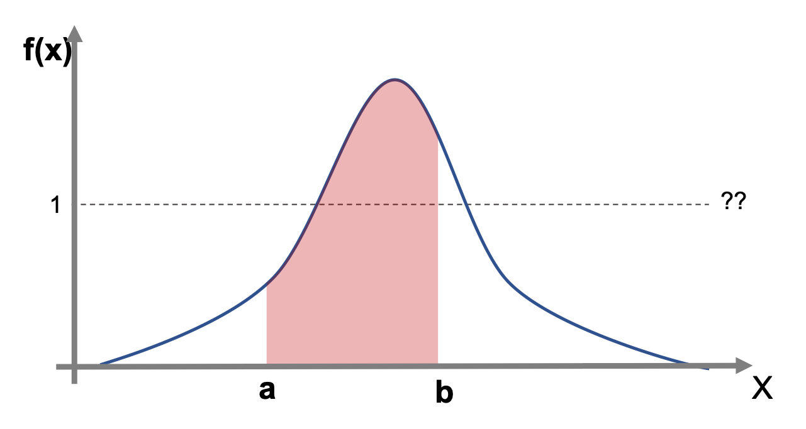

## [5-2] 확률분포 Probability Distribution

숫자로 표현될 수 될 수 있는 모집단이나 샘플을 나타내기 위한 효과적인 방법으로는 확률분포를 이용하는 방법이 있다. 정규분포나 이항분포와 같은 이름들은 들어봤을 것이다. 이들 또한 어떤 특징을 가진 데이터들의 분포를 효과적으로 표현하기 위해 설계된 분포들이다. (어떤 특징인지는 뒤에 가서 배우도록 하자)

### <5.2.1> 이산분포 Discrete Distributions
이름에서 느껴지듯이 확률변수를 이산형으로 갖는 확률분포를 뜻한다. 설명이 영 이산하다면 아래 예시를 참고하자. 가장 대표적인 이산분포의 예로 주사위 던지기를 들 수 있다. 주사위의 눈금은 1~6까지 존재한다. $P_{i}$를 눈금 $i$가 나올 확률이라고 정의한다면  

$P_{i} = 1/6, i=1,...,6$

으로 나타낼 수 있으면, 이때 $P_{i}$가 이루는 분포가 주사위 던지기의 확률분포를 나타내는 것이다. 당연하지만 모든 확률의 합은 1이여야 하며, 확률은 항상 0 혹은 1보다 작은 양수의 값을 가진다.

$0\leq P_{i} \leq 1, \forall i\in \natnums \;(\natnums는 자연수)$

$\sum_{i=1}^n P_{i}=1$ (확률의 합은 1이다)

이러한 $P_{i}$를 확률질량함수(Probability mass function)라고 부르기도 한다.   

### <5.2.2> 연속 분포 Continuous Distributions   
만약 확률변수가 X가 주사위 눈금처럼 정수값을 갖는 이산형 변수가 아닌 신장(cm)과 같이 실수값을 갖는 연속형 변수라면 확률분포를 어떻게 표현할 수 있을까? 그것을 나타내기 위해 나온 것이 확률밀도함수 (Probability density function;PDF)이다.   
PDF을 이해할 때 주의할 것은 y축이 확률이 아니라는 것이다. 처음 공부하시는 분들이 흔히 저지르는 실수이다. 그래서 y축을 p(x)가 아니라 f(x)라고 표현한 것이다. 또 보다시피 1을 넘는 값을 가질 수도 있다. 확률의 공리에서 이미 어긋나있다. 그럼 우리는 연속형 확률변수의 확률은 어떻게 구해야할까? 그래서 우린 연속형 변수의 확률은 범위로써 접근한다. 예를 들어 아무 사람을 불렀을 때 신장이 180~190cm일 확률과 같은 방식이다. (필자는 저 확률과는 무관한 삶을 살고있다.)

- $P(a<X<b)=\int_{a}^bf(x)dx \; (a,b \in \Reals)$   
- $\int_{-\infty}^{\infty}f(x) = 1$ (확률밀도함수를 모두 적분하면 1이다)    

    

[본 내용은 'An introduction to statistics to statistics with python'이라는 원서를 읽고 요약 맟 가공를 한 내용임을 공지드립니다. 조금더 자세히 알고 싶으신 분든을 본 원서를 참고하시면 좋을 것 같습니다. 혹시 저작권에 문제가 된다면 내리도록 하겠습니다. 좋은 하루 되세요.]