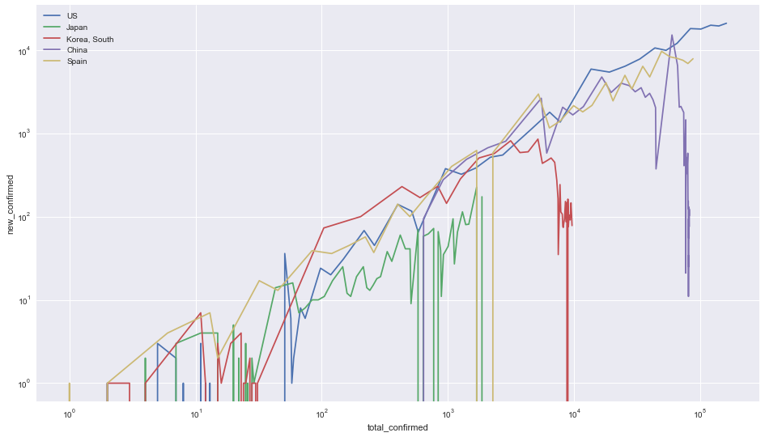
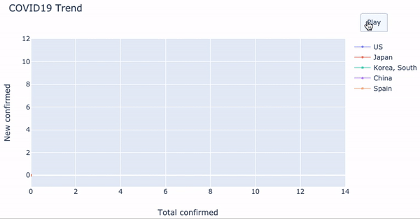

안녕하세요, 박도형입니다.

최근 **코로나19, 공식명칭 COVID19 분석 관련 재밌는 시각화**를 하나 찾았습니다. 

이름하여 <a href="https://aatishb.com/covidtrends/">Aatish Bhatia의 Covid Trend</a>라는 그래프인데요 🙌

1. log scale을 통해 **데이터의 상대적 증감 트렌드**를 이해 할 수 있게 돕고,
2. 총 확진자 수와 신규 확진자 수를 각각 x축과 y축에 둠으로써 **증가 트렌드에서 벗어나는 국가들을 명확히 파악**할 수 있게 도와주는

아주 매우 멋진 그래프입니다.

(그래프의 유용성에 대한 좀 더 자세한 설명은 아래 유튜브를 통해 확인해보세요)

<iframe width="560" height="315" src="https://www.youtube.com/embed/54XLXg4fYsc" frameborder="0" allow="accelerometer; autoplay; encrypted-media; gyroscope; picture-in-picture" allowfullscreen></iframe>


**각설하고 이런 좋은 그래프는 좀 따라해봐야 실력이 늘겠죠?** 그래서 한번 연습해봤습니다.

위 그래프는 **Vue.js와 Plotly.js**로 만들어져 있어, 저도 Plotly를 연습할 겸 **Python**으로 간단하게 만들어봤습니다.


먼저 필요한 라이브러리들을 import해줍니다(seaborn으로도 static한 그래프를 만들어보기 위해 plt style을 seaborn으로 설정했습니다)
```py
import pandas as pd
import numpy as np
import matplotlib.pyplot as plt
import seaborn as sns
import plotly.graph_objects as go

plt.style.use('seaborn')
```

다음으로 <a href="https://github.com/CSSEGISandData/COVID-19/tree/master/csse_covid_19_data">CSSEGISandData</a>에서 COVID19의 시계열 데이터를 받아왔습니다.

```py
url = 'https://raw.githubusercontent.com'\
'/CSSEGISandData/COVID-19/master/csse_covid_19_data/'\
'csse_covid_19_time_series/time_series_covid19_confirmed_global.csv'

# read COVID19 time series data from GSSEGISandData
covid_19_global_confirmed = pd.read_csv(url)
```

이렇게 csv를 읽어보면, COVID19 Time Series 데이터를 확인해보면 가로로 일자별 총 확진자 수 누적되어 있는 형태라는 것을 알 수 있습니다. 

예를 들면 아래와 같은 형태인 것이죠.

| Province/State | Country/Region |   Lat   |  Long   | 1/22/20 | 1/23/20 | $\cdots$ |
| -------------- | :------------: | :-----: | :-----: | :-----: | :-----: | :------: |
| NaN            |  Afghanistan   | 33.0000 | 65.0000 |    0    |    0    | $\cdots$ |

따라서 이제 전처리가 필요합니다. **저는 크게 총 3가지의 전처리를 해줬습니다.**

1. 누적 확진자 수 데이터에서 신규 확진자 수 데이터를 역산하는 일 $\rightarrow$ `np.diff`로 계산.
2. column형태의 데이터를 row형태로 변경하는 일 $\rightarrow$ `melt`로 변경.
3. (당장은) 불필요한 column들을 drop하는 일 $\rightarrow$ `drop`으로 drop.

```py

# drop not required field
covid_19_global_confirmed.drop(columns=['Lat', 'Long', 'Province/State'], inplace=True)
covid_19_global_confirmed = covid_19_global_confirmed.groupby(['Country/Region']).sum()

# get new cases using np.diff
covid_19_global_confirmed_new = covid_19_global_confirmed.diff(axis=1).fillna(0)

# reset index and renaming columns
covid_19_global_confirmed = covid_19_global_confirmed.reset_index().melt('Country/Region')
covid_19_global_confirmed.columns = ['country', 'date', 'total_confirmed']
covid_19_global_confirmed_new = covid_19_global_confirmed_new.reset_index().melt('Country/Region')
covid_19_global_confirmed_new.columns = ['country', 'date', 'new_confirmed']

# merge two tables
covid_19_global_confirmed = pd.merge(covid_19_global_confirmed_new, covid_19_global_confirmed)
```

이제 seaborn으로 간단하게 시각화를 해봅시다!

```py
plt.figure(figsize=(16, 9))
countries = ['US', 'Japan', 'Korea, South', 'China', 'Spain']

for country in countries:
    df = covid_19_global_confirmed.query('''country == @country''')
    sns.lineplot(x='total_confirmed', y='new_confirmed', data=df, label=country,  estimator=None)
    
plt.xscale('log')
plt.yscale('log')
plt.show()
```

`query`를 통해 원하는 국가만 필터링(국가는 임의로 정했습니다), x와 y를 `plt.xscale`과 `plt.yscale`로 log scaling해준 후 plotting하는 부분입니다. 정상적으로 코드가 동작한다면, 아래와 같은 그래프를 얻으실 수 있습니다.



이제는 plotly로 이런 정적인 그래프를 좀 더 다이나믹하게 바꿔봅시다.

저는 보고 싶은 국가들만 보기 위해 아래와 같이 `query`로 추리고, plotly에서 지원하는 log scale 기능이 0을 포함하는 고정 range를 줬을 때 `exception`을 raise해서 데이터에서 애초에 log scale을 줬습니다.
```py
df = covid_19_global_confirmed.query('''country == @countries''').copy()
df['new_confirmed'] = np.log(df.new_confirmed + 1)
df['total_confirmed'] = np.log(df.total_confirmed + 1)
```

이제는 animation을 그려볼 차례입니다. 그저 할 일은 plotly가 이해할 수 있게 데이터의 형태를 다시한번 바꾸는 것 뿐입니다.

저는 각 국가별 각 frame마다(시점 마다) series를 하나씩 늘려가며 data 형태를 만져줬습니다.

```py
traces = list()
series_list = list()
frames = list()

for country_name in countries:
    c = df.query('''country == @country_name''')
    trace = go.Scatter(x=[0,0], 
                       y=[0,0],
                       showlegend=True,
                       mode='lines+markers', 
                       marker_size=4,
                       opacity=0.8,
                       line=dict(width=1),
                       name=country_name)
    traces.append(trace)
    for i in range(1, len(c) - 1):
        try:
            series_list[i-1].append({
                'type': 'scatter',
                'x': c.total_confirmed[:i+1],
                'y': c.new_confirmed[:i+1],
                'name': country_name
            })
        except IndexError:
            series_list.append([{
                'type': 'scatter',
                'x': c.total_confirmed[:i+1],
                'y': c.new_confirmed[:i+1],
                'name': country_name
            }])
            
for series in series_list:
    frames.append({
        'data': series,
        'traces': list((range(0, len(countries))))
    })
```

이제 간단한 `play button`을 만들어줍니다. 여기서 이해할 점은 duration이 1 frame마다 걸리는 속도라는 것 뿐입니다 👈

```py
button_options = [dict(label='Play', 
                       method='animate', 
                       args=[None, dict(frame=dict(duration=120, redraw=False), 
                                        transition=dict(duration=0),
                                        fromcurrent=True,
                                        mode='immediate')])]
```

이제 `Layout`을 만들고 실제 잘 동작하는지 보기만 하면 끝입니다.

```py
layout = go.Layout(width=800,
                   height=450,
                   showlegend=False,
                   hovermode='closest',
                   updatemenus=[dict(type='buttons', 
                                     showactive=False,
                                     y=1.05,
                                     x=1.15,
                                     xanchor='right',
                                     yanchor='bottom',
                                     pad=dict(t=0, r=10),
                                     buttons=button_options)
                               ])


layout.update(xaxis =dict(range=[0, 14]),
              yaxis =dict(range=[-1, 12]))
fig = go.Figure(data=traces, frames=frames, layout=layout)
fig.update_layout(showlegend=True, xaxis_title='Total confirmed', yaxis_title='New confirmed', title='COVID19 Trend')
fig.show()
```



---

**후기**

* 평소에 쓸 일이 거의 없어 잘 안쓰다가 이번에 써보니 python에서의 plotly 사용성이 좋지 않습니다. 원래는 `plotly.express`를 쓰는 튜토리얼을 만들려고 했는데, 정상적으로 argument를 보내도 animation이 실행되지 않는 기적을 보았습니다 ~~(R에서 한방에 그려지는 예제가 있던데 ...)~~
* 오늘의 결론은 **좋은 시각화는 좋은 인사이트를 만들어준다는 것**입니다.